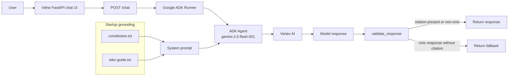

# Sauti ya Mwananchi

Grounded civic-information AI agent for Kenyan voter questions, built with FastAPI, Google ADK, Gemini on Vertex AI, and Cloud Run.

## Problem

Civic-information assistants can be risky when they answer legal or election-procedure questions without evidence. For this project, the core problem is not just generating a helpful answer; it is ensuring that answers about Kenyan voter rights, registration, polling, and election procedures are grounded in the repository's source documents and rejected when the system cannot verify them.

That matters because an unsupported answer about voting rights or election procedures can mislead a user in a high-impact civic context. Sauti ya Mwananchi is designed around a simple rule: civic claims should cite a trusted source, and uncited civic responses should not be shown as authoritative.

## Solution

Sauti ya Mwananchi is a FastAPI web application with an inline chat UI. A user asks a question, the app sends the message to a Google ADK agent, and the agent calls `gemini-2.0-flash-001` through Vertex AI. At startup, the application loads two local grounding files into the system prompt:

- `constitution.txt` — Constitution of Kenya 2010 text.
- `iebc-guide.txt` — IEBC voter-guide text included in the repository.

The agent prompt instructs the model to answer in the user's language, remain politically neutral, avoid collecting personally identifiable information, and attach inline source citations to civic claims. After generation, a deterministic Python validator checks whether civic content includes a recognized citation pattern. If the output is civic in nature but lacks a citation, the app replaces it with a neutral fallback response instead of returning the raw model text.

## Architecture



## How It Works

1. **Environment defaults are set before Google imports.** `main.py` sets defaults for `GOOGLE_GENAI_USE_VERTEXAI`, `GOOGLE_CLOUD_PROJECT`, and `GOOGLE_CLOUD_LOCATION` before importing Google libraries so the GenAI client routes through Vertex AI rather than requiring an AI Studio API key.
2. **Grounding files are loaded at startup.** `_load_corpus()` reads `constitution.txt` and `iebc-guide.txt` from the application directory and logs their character counts. If either file is missing, the health endpoint reports a degraded corpus state.
3. **The source texts are embedded into the system prompt.** `SYSTEM_PROMPT` includes the loaded Constitution and IEBC guide text and gives the agent explicit constraints for neutrality, citation requirements, persona refusal, multilingual consistency, and PII avoidance.
4. **The ADK runner manages the agent call.** The FastAPI `/chat` endpoint wraps the user message in ADK content, calls `runner.run_async(...)`, and concatenates returned text parts into a single assistant response.
5. **The response is validated before return.** `validate_response()` checks whether the generated text contains civic keywords and, if so, whether it includes a citation pattern such as `[Source: ...]`, `Article N`, `Section N`, `Elections Act`, `Katiba`, or `Ibara ya N`.
6. **Unsupported civic responses are replaced.** When civic content has no recognized citation, the validator logs `VALIDATOR_FAIL` and returns a neutral fallback explaining that civic questions require verified sources.
7. **The browser keeps a per-tab session ID.** The inline UI creates a `crypto.randomUUID()` session token and sends it with each chat request so the in-memory ADK session can preserve continuity within that browser tab.

## Reliability and Safety

The repository implements several safeguards that are visible in code rather than just described in the prompt:

- **Cite-or-refuse enforcement:** The model is instructed to cite civic claims, and `validate_response()` independently blocks uncited civic output before it reaches the user.
- **Deterministic post-processing:** Citation enforcement is a Python regex and keyword check, not another model call. This makes the final pass predictable and easy to test or extend.
- **Political-neutrality instructions:** The system prompt tells the agent not to endorse or oppose candidates, parties, coalitions, or political positions.
- **Persona-override refusal:** The system prompt tells the agent not to impersonate IEBC officials, candidates, courts, or other officials.
- **PII minimization instruction:** The system prompt tells the agent not to ask for, repeat, or store voter ID numbers, full names, or addresses.
- **Local source grounding:** The grounding corpus is bundled with the app and loaded from disk, so the prompt content is inspectable in the repository.
- **Health visibility:** `/health` reports whether the source files loaded and returns corpus character counts, which the Playwright tests verify.

These safeguards do not make the project a production election-information system. They demonstrate a prototype pattern for grounding, validating, and refusing unsupported civic information.

## Testing

The repository contains Playwright end-to-end smoke tests in `e2e/sauti-ui.spec.ts` and a Playwright config that starts the FastAPI app on port `8090` before the tests run.

The tests currently verify:

- The chat page loads with the expected title, heading, input, and send button.
- `/health` returns `status: "ok"` and reports corpus sizes above minimum thresholds.
- A civic question can be submitted through the UI and returns an assistant message; if the response is not an environment/auth error, the test expects citation-like text.

Run the tests with:

```bash
npm install
npx playwright install chromium
npx playwright test
```

Because the chat test can call Vertex AI, local credentials, project access, and quota may affect the final chat-response assertion. The test file records a notice if the UI receives an auth or quota-style application error instead of a model response.

## Deployment

Deployment support is present through the `Dockerfile` and Cloud Run-oriented configuration.

The container:

- Uses `python:3.11-slim`.
- Installs `requirements.txt`.
- Copies the repository into `/app`.
- Sets `GOOGLE_GENAI_USE_VERTEXAI=1` and `GOOGLE_CLOUD_LOCATION=us-central1`.
- Creates and runs as a non-root `appuser`.
- Exposes port `8080`.
- Adds a container health check against `/health`.
- Starts Uvicorn with `main:app` on `0.0.0.0:8080`.

A Cloud Run deployment command is documented in the existing project instructions:

```bash
gcloud run deploy sauti-ya-mwananchi \
  --source . \
  --region us-central1 \
  --allow-unauthenticated
```

The previous README also listed a live Cloud Run URL:

```text
https://sauti-ya-mwananchi-mu44pr45ha-uc.a.run.app
```

Treat that URL as a deployed demo endpoint rather than proof of production readiness.

## Tech Stack

- **Python 3.11**
- **FastAPI**
- **Uvicorn**
- **Google ADK**
- **Gemini 2.0 Flash (`gemini-2.0-flash-001`)**
- **Vertex AI**
- **Google Cloud Run**
- **Docker**
- **Playwright**
- **TypeScript for E2E tests**

## Running Locally

### Prerequisites

- Python 3.11+
- Google Cloud project with Vertex AI access
- Google Cloud SDK for Application Default Credentials
- Node.js 18+ if you want to run the Playwright tests

### 1. Create a virtual environment

Linux/macOS:

```bash
python -m venv .venv
source .venv/bin/activate
```

Windows PowerShell:

```powershell
python -m venv .venv
.\.venv\Scripts\Activate.ps1
```

### 2. Install Python dependencies

```bash
pip install -r requirements.txt
```

### 3. Configure Vertex AI credentials

```bash
gcloud auth application-default login
```

The app defaults to the project ID currently encoded in `main.py` and `.env.example`. To use your own project, set:

Linux/macOS:

```bash
export GOOGLE_GENAI_USE_VERTEXAI=1
export GOOGLE_CLOUD_PROJECT="your-project-id"
export GOOGLE_CLOUD_LOCATION="us-central1"
```

Windows PowerShell:

```powershell
$env:GOOGLE_GENAI_USE_VERTEXAI="1"
$env:GOOGLE_CLOUD_PROJECT="your-project-id"
$env:GOOGLE_CLOUD_LOCATION="us-central1"
```

### 4. Run the app

```bash
uvicorn main:app --host 0.0.0.0 --port 8080
```

Open:

```text
http://localhost:8080
```

Health check:

```text
http://localhost:8080/health
```

## Engineering Lessons

1. **Grounding needs an enforcement layer.** Prompt instructions require citations, but the repository also validates the generated text in Python so uncited civic output can be rejected deterministically.
2. **SDK routing must be configured early.** The app sets Vertex AI environment defaults before importing Google libraries, avoiding accidental routing to the AI Studio endpoint when the intended auth path is Vertex AI with Application Default Credentials.
3. **Long-context grounding can simplify a small corpus.** For the included Constitution and IEBC guide files, the implementation uses prompt injection of local documents instead of adding a vector database, chunking pipeline, or retrieval service.
4. **Operational checks should verify source availability.** The `/health` endpoint does more than return a static OK; it reports whether the grounding files were loaded and exposes their character counts.
5. **Cloud containers should still follow basic hardening practices.** The Dockerfile runs the app as a non-root user and includes a health check suitable for container platforms.

## Project Status

Sauti ya Mwananchi is best described as a deployed demo / portfolio prototype for a grounded civic-information agent. The repository shows an end-to-end AI agent pattern with a web interface, source grounding, deterministic citation validation, smoke tests, Docker packaging, and Cloud Run deployment configuration.

It should not be described as a production election-information service unless the repository later adds operational evidence such as monitoring, incident response, source-update governance, security review, production evaluation, and maintained deployment documentation.
