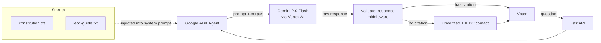

# Sauti ya Mwananchi

A civic-accountability AI agent that answers Kenyan voters' questions in English, Swahili, or Sheng — grounded in primary legal sources and bound by a Python middleware that enforces a cite-or-refuse rule on every response.

**Live:** https://sauti-ya-mwananchi-mu44pr45ha-uc.a.run.app
**Built at:** GDG Nairobi Agentathon — May 2026

---

## The problem

Kenyan voters get civic information through WhatsApp forwards, partisan blogs, and rumour. The cost of bad civic information is real: people miss registration deadlines, show up at the wrong polling station, or vote on misinformation about their constitutional rights. A generic chatbot makes it worse — confidently hallucinating about election law is not better than no answer at all.

Sauti ya Mwananchi answers civic questions only when it can cite a primary source, and refuses when it cannot. The audience is any Kenyan voter with a phone and a question — across all three languages they actually use.

---

## How it works

Two source documents are loaded at startup and injected into the system prompt:

- **Constitution of Kenya 2010** — full text, ~360 KB, ~90,000 tokens
- **IEBC Official Voter Guide** — polling procedures, registration requirements

Every model response passes through `validate_response`, a Python middleware that checks for an inline citation pattern (`[Source: Constitution Article N]`, `[Source: IEBC Voter Handbook]`, etc.). If no citation is present, the response is replaced with `"Unverified"` and the user is directed to the IEBC hotline. The model's raw output never reaches the user unchecked.



### Agent modes

The agent operates across five behavioural personas, switching based on context:

| Mode | Swahili name | Role |
|------|--------------|------|
| Assistant | Msaidizi | Multilingual front-end, routes to the right mode |
| Teacher | Mwalimu | Civic education with primary-source citations |
| Guide | Kiongozi | Polling station and procedural step-by-step guidance |
| Truth-checker | Ukweli | Fact-checking; `"Unverified"` is an acceptable answer |
| Companion | Mwenza | Election-day support and real-time guidance |

### Hard constraints (cannot be overridden)

Enforced at both prompt and validator layers, across all languages:

1. **Political neutrality** — no candidate or party endorsements; cites Article 38 on free political choice when asked who to vote for.
2. **Citations required** — every civic claim must include an inline source reference.
3. **No persona impersonation** — refuses to roleplay as IEBC officials or candidates.
4. **No PII collection** — will not ask for or repeat voter ID numbers, full names, or addresses.

---

## Tech stack

| Layer | Choice | Why |
|-------|--------|-----|
| Language | Python 3.11 | First-class Google ADK + Vertex AI support |
| Web framework | FastAPI + Uvicorn | Async, low-overhead, fits Cloud Run's request model |
| AI framework | Google ADK (`google-adk`) | Native agent runner with session/memory primitives |
| LLM | Gemini 2.0 Flash via Vertex AI | 1M-token context window enables full-corpus grounding without a vector DB |
| Output safety | `validate_response` middleware | Deterministic regex enforcement — model cannot bypass |
| Container | Docker (python:3.11-slim) | Reproducible Cloud Run deployments |
| Deployment | Google Cloud Run (us-central1) | Scales to zero, workload identity (no keys to manage) |
| E2E tests | Playwright (TypeScript) | Verifies citation enforcement against a live FastAPI instance |

**On the no-vector-DB choice:** Gemini's 1M-token window comfortably fits both source documents (~90k tokens combined). Embeddings, chunking, and retrieval round-trips add latency and operational surface area for no accuracy gain at this corpus size. The grounding is the prompt.

---

## Running locally

### Prerequisites

- Python 3.11+
- A Google Cloud project with the **Vertex AI API** enabled
- [Google Cloud SDK](https://cloud.google.com/sdk/docs/install) (`gcloud` CLI)
- Node.js 18+ (only for E2E tests)

### Setup

```bash
python -m venv .venv
.\.venv\Scripts\activate          # PowerShell
# source .venv/bin/activate       # Linux/macOS

pip install -r requirements.txt
gcloud auth application-default login
```

The app uses Application Default Credentials — no API keys, no `.env` required.

If your GCP project ID differs from `gdgagentathon-kenn`:

```bash
$env:GOOGLE_CLOUD_PROJECT="your-project-id"   # PowerShell
# export GOOGLE_CLOUD_PROJECT=your-project-id  # Linux/macOS
```

### Run

```bash
uvicorn main:app --host 0.0.0.0 --port 8080
```

Open http://localhost:8080. The `/health` endpoint reports loaded corpus sizes.

### E2E tests

```bash
npm install
npx playwright install chromium
npx playwright test
```

Playwright auto-starts a FastAPI instance on port 8090. Tests verify page load, corpus loading (>100 KB each), and citation enforcement on civic responses.

---

## Deploying to Cloud Run

A single command builds, pushes, and deploys:

```bash
gcloud run deploy sauti-ya-mwananchi \
  --source . \
  --region us-central1 \
  --allow-unauthenticated
```

The `Dockerfile` sets `GOOGLE_GENAI_USE_VERTEXAI=true` and `GOOGLE_CLOUD_LOCATION=us-central1` so the container routes through Vertex AI on cold start. Workload identity handles auth — no service account keys.

---

## Project structure

```
sauti-ya-mwananchi/
├── main.py              # FastAPI app, ADK agent, validate_response, inline UI
├── constitution.txt     # Constitution of Kenya 2010 (full text)
├── iebc-guide.txt       # IEBC Official Voter Guide
├── requirements.txt
├── Dockerfile           # Cloud Run container
├── convert_pdf.py       # One-time: rebuilds constitution.txt from PDF
├── playwright.config.ts
├── package.json         # Playwright only
└── e2e/
    └── sauti-ui.spec.ts # Load, health, citation enforcement
```

---

Built by **Kenn Macharia** — [SuperiaTech](https://superiatech.vercel.app/)
